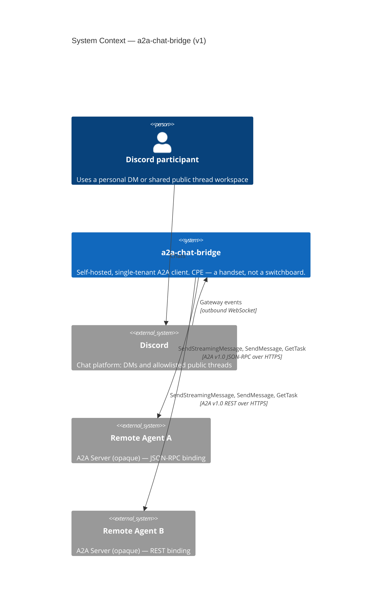

# 01 — System Context

C4 Level 1: a2a-chat-bridge in its environment — the user, Discord, and the
remote A2A agents it talks to. Remote agents are opaque A2A Servers, described by
what their Agent Card advertises. The operator declares Contacts in local
configuration by exact Agent Card URL; the bridge never auto-routes traffic.

Rendered SVG: [proposal diagrams](../proposal/multi-platform-bridge/diagrams/).

## Agents integrated

No static integration wiring — by design (see the proposal's Reference shape).
Configured Agent Card URLs become Contacts at runtime; the bridge fetches each
supplied URL verbatim and caches the card.

| Binding        | Interaction                                                                                    | Notes                                                                                          |
| -------------- | ---------------------------------------------------------------------------------------------- | ---------------------------------------------------------------------------------------------- |
| JSON-RPC       | `SendStreamingMessage` primary; `SendMessage` (`returnImmediately: true`) + `GetTask` fallback | A2A v1.0 only                                                                                  |
| HTTP+JSON/REST | Same semantics, REST transport                                                                 | gRPC-only agents out of scope ([ADR-0002](../decisions/0002-typescript-with-portable-core.md)) |

## Context

a2a-chat-bridge lets a workspace owner and their invited collaborators talk to
any A2A v1.0 agent from Discord without giving any third party a position in the
traffic path. A public thread can be a shared agent workspace only when its
parent is allowlisted; otherwise the bridge remains DM-first. Motivation and
trade-offs:
[proposal](../proposal/multi-platform-bridge/README.md),
[ADR-0001](../decisions/0001-chat-bridge-as-cpe-mvp.md).
