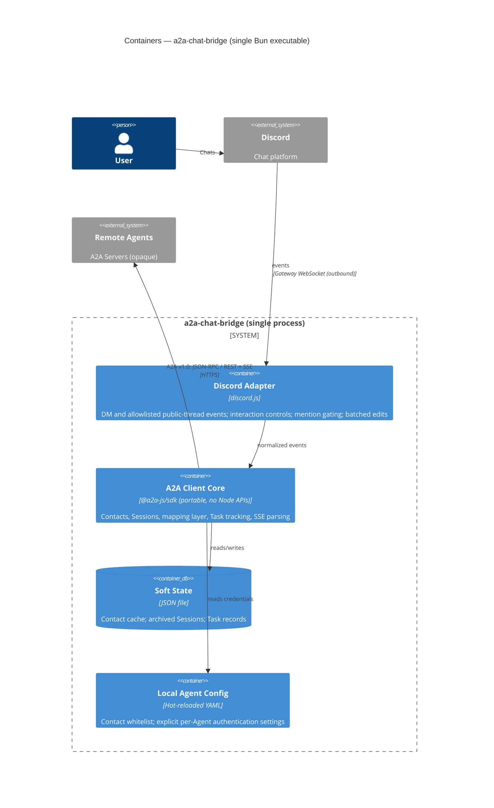

# 02 — Containers

C4 Level 2: a2a-chat-bridge is a **single Bun executable** — one process holding
the Discord adapter, the portable A2A client core, rebuildable soft state, and
attachment-only config ([ADR-0001](../decisions/0001-chat-bridge-as-cpe-mvp.md),
[ADR-0002](../decisions/0002-typescript-with-portable-core.md),
[ADR-0007](../decisions/0007-hot-reloaded-local-agent-configuration.md),
[ADR-0008](../decisions/0008-archived-sessions-and-task-records.md),
[ADR-0009](../decisions/0009-public-thread-workspaces.md),
[ADR-0010](../decisions/0010-explicit-per-agent-authentication.md),
[ADR-0011](../decisions/0011-channel-agent-policies.md)).

## Containers

| Container          | Tech               | Responsibility                                                                                      | Notes                                                                                                                                                                                              |
| ------------------ | ------------------ | --------------------------------------------------------------------------------------------------- | -------------------------------------------------------------------------------------------------------------------------------------------------------------------------------------------------- |
| Discord Adapter    | discord.js v14     | DM and eligible-thread events; Contact and Session selection; mention-gated requests; batched edits | DMs plus public threads enabled by hot-reloaded channel policies; platform access controls collaboration and policy limits agents ([ADR-0017](../decisions/0017-native-platform-collaboration.md)) |
| A2A Client Core    | @a2a-js/sdk v1.0.x | Contacts, Sessions, mapping layer, Task tracking, SSE parsing                                       | Portable: no Node APIs ([ADR-0002](../decisions/0002-typescript-with-portable-core.md))                                                                                                            |
| Soft State         | JSON file          | Contact cache; Session↔`contextId` mappings; Task records                                           | Rebuildable; Session/task indexes are local metadata while A2A servers remain authoritative ([ADR-0008](../decisions/0008-archived-sessions-and-task-records.md))                                  |
| Local Agent Config | Hot-reloaded YAML  | Contact whitelist; explicit per-Agent OAuth or static-header authentication                         | Validated snapshots apply to new work only; no cross-Agent credential fallback ([ADR-0010](../decisions/0010-explicit-per-agent-authentication.md))                                                |
