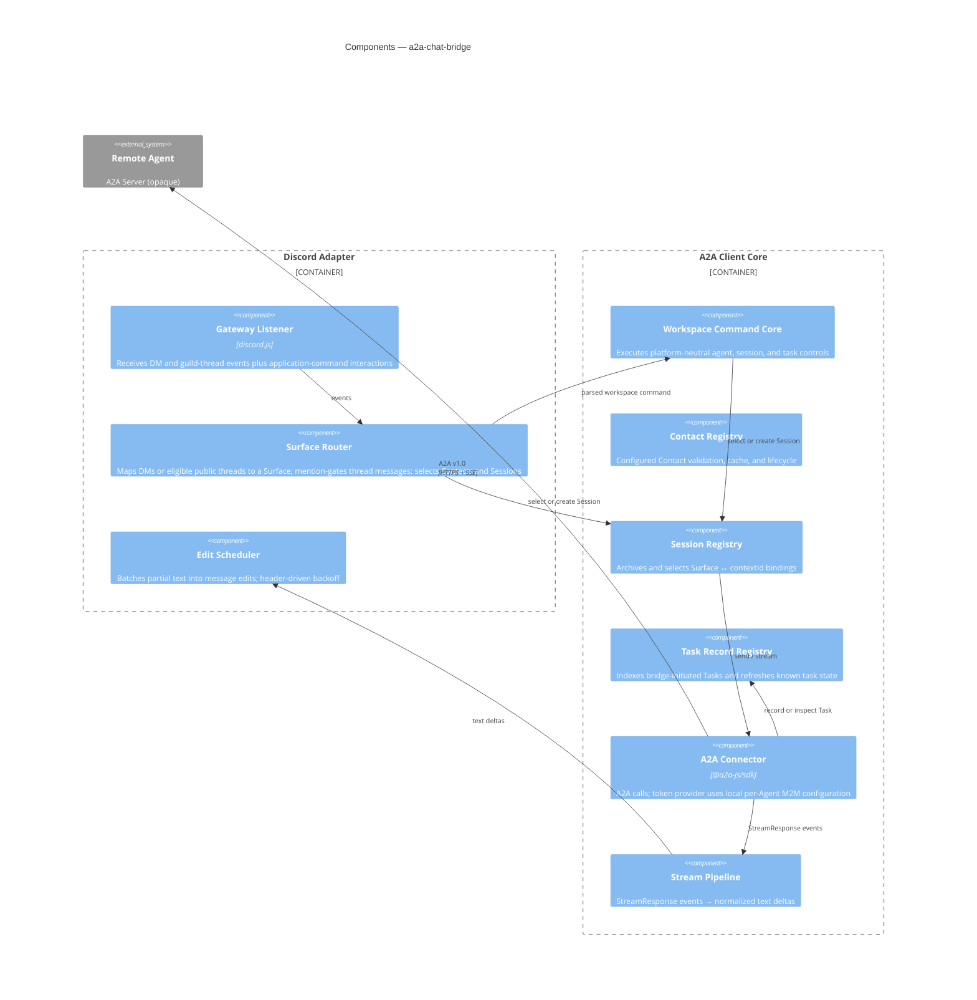

# 03 — Components

C4 Level 3: internals of the shipped bridge process.

## Components

| Component              | Responsibility                                                         | Key types / interfaces | Notes                                                                                                                                                                                          |
| ---------------------- | ---------------------------------------------------------------------- | ---------------------- | ---------------------------------------------------------------------------------------------------------------------------------------------------------------------------------------------- |
| Workspace Command Core | Execute shared Agent, Session, and Task command contract               | typed commands/results | Adapters parse and render; channel policy limits agents while platform access governs collaboration ([ADR-0017](../decisions/0017-native-platform-collaboration.md))                           |
| Gateway Listener       | Discord gateway connection and interaction intake                      | discord.js `Client`    | DMs and bot mentions need no privileged Message Content intent                                                                                                                                 |
| Surface Router         | Map DMs and eligible threads to Surfaces; select Contacts and Sessions | `Surface` union type   | Thread ingress is mention-only; channel policy limits allowed Agents; participants collaborate through native platform access ([ADR-0017](../decisions/0017-native-platform-collaboration.md)) |
| Edit Scheduler         | Batch text deltas into message edits                                   | rate-limit-aware queue | ~1 edit / 1–2s heuristic; rely on discord.js backoff                                                                                                                                           |
| Contact Registry       | Fetch, validate, and cache configured Agent Cards                      | `AgentCard`            | Local configuration is the allowlist ([ADR-0007](../decisions/0007-hot-reloaded-local-agent-configuration.md))                                                                                 |
| Session Registry       | Archive/select Sessions and bind them to `contextId`                   | `Session` record       | A friendly local Session reference selects opaque remote context ([ADR-0008](../decisions/0008-archived-sessions-and-task-records.md))                                                         |
| Task Record Registry   | Index bridge-initiated Tasks and refresh known status                  | `TaskRecord`           | Remote A2A server remains authoritative; no arbitrary remote history discovery ([ADR-0008](../decisions/0008-archived-sessions-and-task-records.md))                                           |
| A2A Connector          | All A2A v1.0 calls; applies each Contact's explicit auth mode          | `@a2a-js/sdk` `Client` | OAuth tokens or static headers only when explicitly selected by that Agent ([ADR-0010](../decisions/0010-explicit-per-agent-authentication.md))                                                |
| Stream Pipeline        | Normalize SSE events to text deltas                                    | `StreamResponse` union | Terminal state closes the loop                                                                                                                                                                 |
