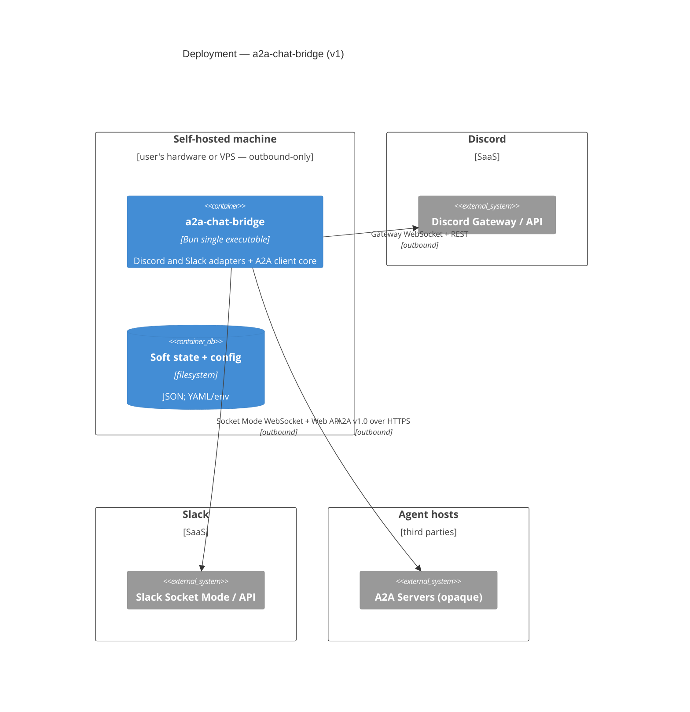

# 04 — Deployment

v1 deployment: one self-hosted instance per workspace, operated by the workspace
owner ([ADR-0001](../decisions/0001-chat-bridge-as-cpe-mvp.md)). All connections
are **outbound-only** — no public endpoint, no inbound ports.

## Environments

| Environment | Purpose                              | URL / location | Notes                 |
| ----------- | ------------------------------------ | -------------- | --------------------- |
| local       | Dogfooding — the only v1 environment | user's machine | Single Bun executable |

## Notes

- No inbound networking is required. A2A push notifications are not implemented;
  a future proposal must decide how a webhook endpoint is reachable, for example
  through a small VPS or a tunnel.
- The machine needs outbound HTTPS and WebSocket access to the enabled chat
  platform(s) and to whatever hosts the dialed A2A agents. Discord uses its
  Gateway; Slack uses Socket Mode, so neither adapter requires an inbound
  request URL.
