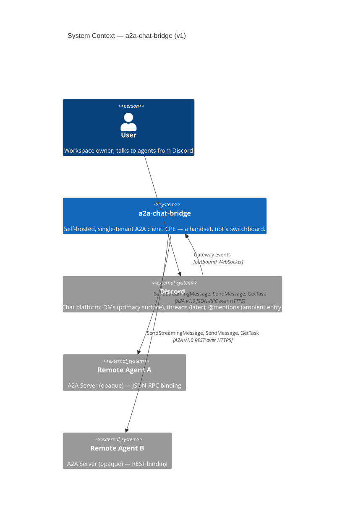
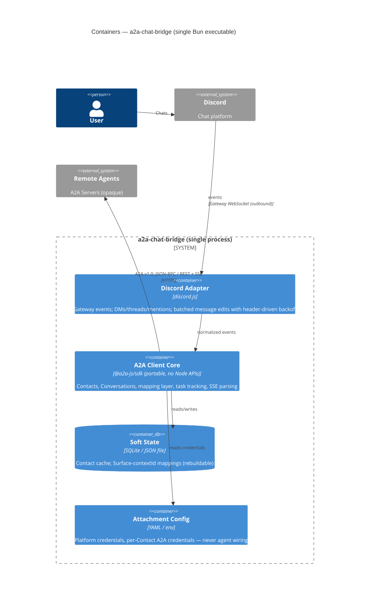
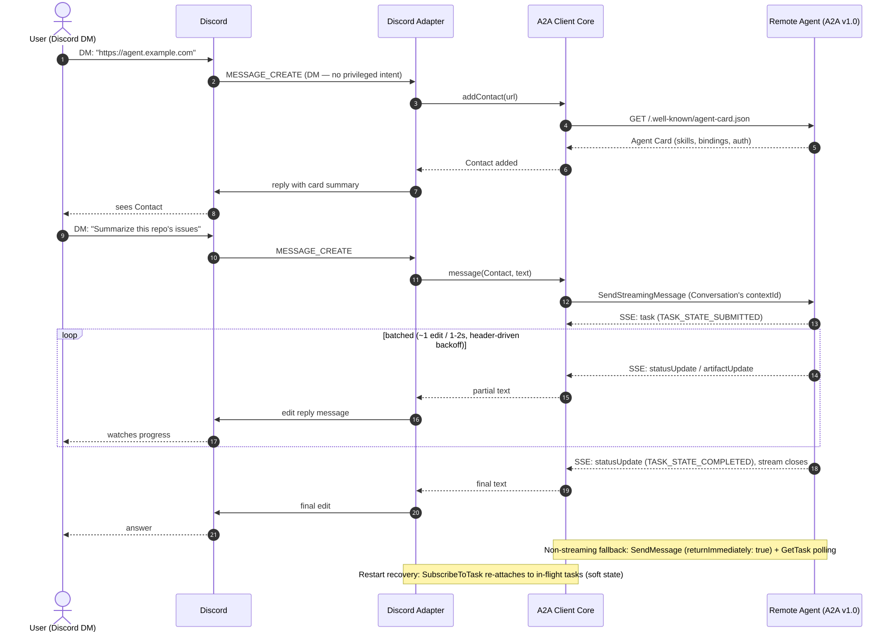

# Proposal: Multi-platform A2A chat bridge

- **Status**: implemented
- **Author**: dubh3124
- **Created**: 2026-08-08
- **Grilled**: 2026-08-08 — all open questions resolved (see below)
- **ADR(s)**: [0001 — CPE MVP shape](../../decisions/0001-chat-bridge-as-cpe-mvp.md),
  [0002 — TypeScript + portable core](../../decisions/0002-typescript-with-portable-core.md),
  [0003 — Contact-model UX](../../decisions/0003-contact-model-ux.md),
  [0004 — Operator-managed M2M OAuth (superseded)](../../decisions/0004-operator-managed-m2m-oauth.md),
  [0005 — Dynamic operator Contact onboarding (superseded)](../../decisions/0005-dynamic-operator-contact-onboarding.md),
  [0006 — Trusted OAuth issuer metadata (superseded)](../../decisions/0006-trusted-oauth-issuer-metadata.md),
  [0007 — Hot-reloaded local Agent configuration](../../decisions/0007-hot-reloaded-local-agent-configuration.md),
  [0008 — Archived Sessions and Task Records](../../decisions/0008-archived-sessions-and-task-records.md)
- **Research**: [research-stack-verification.md](research-stack-verification.md) —
  stack assumptions verified against primary sources, 2026-08-08 (18 verified, 1
  contradicted, 1 unverified)
- **Validation**: [MVP dogfood validation](validation/mvp-dogfood-2026-08-08.md) —
  confirmed 2026-08-08
- **Diagrams**: [diagrams/](diagrams/) — Mermaid sources (`.mmd`) + rendered SVGs

## Implementation status

This proposal records the original product exploration. The shipped design is
maintained in [architecture](../../architecture/README.md),
[ADRs](../../decisions/README.md), and the [operator guides](../../guides/README.md).

The currently implemented bridge is Discord-DM-only. Contacts are declared by
the operator in local YAML rather than added through chat; native Discord
`/a2a` commands select Contacts, Sessions, and bridge-recorded Tasks. A Session
is the bridge-owned user-facing reference that retains the remote A2A
`contextId`. Threads, channel mentions, Slack, artifact handling, push
notifications, and per-user authorization remain deferred.

The following proposal narrative and rendered diagrams are historical design
material. Where they conflict with the pages above, the architecture and guides
describe the current behavior.

## Diagrams

**System context** — the CPE shape: the bridge as a self-hosted handset between
Discord and any A2A server. ([source](diagrams/system-context.mmd))

**Containers** — one Bun executable: Discord adapter, portable A2A client core,
rebuildable soft state, attachment-only config. ([source](diagrams/containers.mmd))

**DM conversation flow (v1)** — add Contact by URL, stream with batched edits,
with the polling fallback and restart recovery noted.
([source](diagrams/dm-conversation-flow.mmd))

## Problem

A2A agents are opaque HTTP services (A2A Servers). The people who want to use them
live in Slack and Discord. Today, connecting an A2A agent to a chat platform means
writing a bespoke bot, and the existing options are unsatisfying:

- Slack/Discord never speak A2A natively, so a translation layer is always required.
- Existing bridges are either bound to one vendor ecosystem (kagent templates) or
  are entire "agent OS" runtimes that bundle their _own_ agents rather than acting
  as a client to arbitrary remote A2A servers.
- iPaaS glue (Zapier/n8n/Make) works for simple request/response but breaks down on
  streaming, multi-turn context, and artifacts.

There is no standalone, vendor-neutral, self-hostable bridge that fronts **any**
A2A server on a chat platform.

## Proposal

Build **a2a-chat-bridge**: a single-process bridge that connects chat platforms to
any A2A-compatible agent. Users add agents as **Contacts** by pasting an Agent Card
URL; the bridge discovers them and hosts **Conversations** on the platform's
natural **Surfaces**. (Vocabulary: see root `CONTEXT.md`.)

First user: **dogfooding** — one self-hosted deployment, your own workspace, your
own agents. v1 succeeds if you use it daily.

Core design ideas (to be refined in architecture docs on acceptance):

- **A2A client core** — built on `@a2a-js/sdk` (v1.0.x, Workers-safe client
  surface). Agent Card discovery (`/.well-known/agent-card.json`), `SendMessage`,
  `SendStreamingMessage` (SSE), task tracking and polling (`GetTask`),
  push-notification config, artifact retrieval. Pure A2A client; the bridge
  originates A2A calls, it does not proxy A2A traffic (deliberately _not_ a
  "gateway" — that term is taken by the Linux Foundation agentgateway project and
  its peers). Written as a portable, platform-agnostic module (no Node APIs) so it
  can be lifted into other runtimes or languages later. Bindings: JSON-RPC and
  HTTP+JSON/REST agents (gRPC-only agents are out of scope — gRPC is Node-only in
  the SDK and would break portability).
- **Platform adapters** — thin, one per chat platform; each adapter defines its own
  Surfaces:
  - **Discord (first)**: Gateway WebSocket (outbound-only, mainstream default).
    Surfaces: DMs (primary, dogfooding — no privileged intent needed), threads
    (shared surface, later), channel @mention (ambient entry that opens a thread).
  - Later: Slack (Socket Mode), Telegram, Teams. iPaaS/webhook mode as a fallback
    for zero-infra setups.
- **Mapping layer** — the heart of the product:
  - Surface ↔ Conversation ↔ A2A `contextId`: one persistent Conversation per
    Contact per DM; one Conversation per thread in guilds.
  - Chat message ↔ A2A Message (Parts: text, files, structured data).
  - SSE task/artifact updates ↔ progressive edits of a single chat message,
    rate-limit aware (batched, ~1 edit / 1–2s — a tunable heuristic, not a
    documented limit; rely on discord.js's header-driven REST backoff).
  - Artifacts ↔ native file uploads + rich cards (Block Kit / embeds). _(deferred past v1)_
  - Long-running Tasks: non-blocking send (`SendMessage` with
    `returnImmediately: true` — v1.0 defaults to blocking-until-terminal), deliver
    final result via `GetTask` polling or A2A push notifications. _(push deferred past v1)_
- **Config is attachment-only**: static config (YAML/env) holds platform
  credentials, per-Contact A2A credentials, and display preferences — never
  agent↔channel wiring. Contacts are added by users, not provisioned by an
  operator.

**Stack (resolved)**: TypeScript — `a2a-js` SDK + `discord.js`; single process;
distributed as a Bun single executable. (Rust with WASM/FFI bindings was considered
and rejected for v1: FFI tax, two toolchains, no concrete WASM host for a bot-token
daemon. The portable core keeps a later rewrite un-foreclosed.)

**MVP scope (resolved)**: the conversational core — add Contact by URL, DM-first
Conversations, text in/out, SSE streaming → batched edits, `SendMessage` + polling
fallback. Deferred: artifact file uploads, push notifications, threads/shared
surfaces, per-user auth passthrough.

Example flow (v1): user DMs the bridge an Agent Card URL → Contact added (card
fetched and cached) → user chats; each message becomes a `SendStreamingMessage`
call on the Contact's Conversation `contextId` → SSE updates are batched into
edits of one reply message → final text lands in the DM.

## Reference shape: CPE, not exchange

Design principle: **the bridge is customer-premises equipment for the A2A network —
a handset, not a switchboard.** In A2A's actor model it is simply an _A2A Client_
with a chat front-end; it adds no new element to the network. Sequencing principle
(from the interoperability literature): **interoperability before autonomy** —
smart routing, orchestration, or trust scoring may arrive later as separate agents
that are themselves A2A citizens, never baked into the bridge.

| Telephony                               | Network                | In this app                                                               |
| --------------------------------------- | ---------------------- | ------------------------------------------------------------------------- |
| Switchboard operator / central exchange | Broker / hosted router | **Rejected** — no hosted routing service, no operator-patched connections |
| ATA / modem (CPE)                       | Edge protocol adapter  | **The bridge** — Slack/Discord local loop ↔ A2A, owned by the workspace   |
| E.164 number                            | IP address / DNS name  | Agent Card URL — agents are addressable; users add them as Contacts       |
| Phone book                              | Resolver cache         | Local Agent Card / Contact cache                                          |
| SS7 signaling                           | Session control        | A2A task lifecycle (send, stream, cancel, push)                           |

Hold this line in design review:

- **Switchboard behavior (reject):** static admin wiring of agents↔channels; silent
  auto-routing; multi-tenant hosting with our infra in the traffic path; mediating
  trust, approvals, or payments; operating a registry.
- **Handset behavior (keep):** adding any agent as a Contact by URL; discovery at
  add time; explicit addressing; per-workspace self-hosting; pass-through rendering
  of agent requests (the bridge renders, never decides); Contact cache as a phone
  book.

### Design corollaries

1. **End-to-end principle** — meaning lives at the edges (user intent, agent
   logic). The bridge translates syntax (platform events ↔ JSON-RPC, Surfaces ↔
   `contextId`, files ↔ artifacts) and never interprets, ranks, or decides.
2. **Soft state only (NAT-style)** — Surface↔`contextId`/taskId mappings are
   rebuildable; authoritative task state lives on the A2A servers. A restarted
   bridge loses nothing.
3. **Per-premises, single-tenant** — one deployment per workspace, operated by the
   workspace owner; never shared infrastructure.
4. **Obsolescence-tolerant** — if chat platforms adopt A2A natively or vendors ship
   their own adapters, the thin adapters die but the A2A client core stays
   reusable. Build nothing whose value depends on the bridge remaining necessary.

## A2A integration points

- **Discovery**: fetch and cache the Agent Card when a Contact is added; declared
  skills may power _suggestions_, never silent routing (see Reference shape).
- **Interaction pattern**: SSE streaming (`SendStreamingMessage`) as primary; fall
  back to non-blocking `SendMessage` (`returnImmediately: true`) + `GetTask`
  polling when the Agent Card declares no streaming capability; A2A push
  notifications to a bridge-hosted webhook (`Bun.serve` endpoint) for very
  long-running tasks _(deferred past v1)_. A restarted bridge can re-attach to
  in-flight tasks via `SubscribeToTask` — supports the soft-state corollary.
- **Protocol version**: A2A v1.0 only. The SDK sends the `A2A-Version: 1.0` header
  (servers treat a missing header as protocol 0.3); the SDK's opt-in `legacyCompat`
  layer for v0.3 agents stays off unless a concrete need appears.
- **Responses**: both Task-based (long-running) and Message-based (immediate);
  Artifacts delivered as native platform file uploads _(deferred past v1)_.
- **Auth**: bridge-level credential per Contact — Agent Card security schemes
  (OAuth2, API key, bearer) held in deployment config, injected as HTTP headers,
  never exposed to the chat platform. All users share the bridge's credential.
  Per-user OAuth passthrough is a deliberately deferred branch.
- **Tenancy**: single-tenant per workspace deployment; credentials scoped to that
  deployment, never aggregated across workspaces (see Reference shape).

## Alternatives considered

Prior-art scan (GitHub, Aug 2026 — keyword search, not exhaustive):

| Alternative                                                                       | What it is                                        | Why not                                                                                                                                                                                                      |
| --------------------------------------------------------------------------------- | ------------------------------------------------- | ------------------------------------------------------------------------------------------------------------------------------------------------------------------------------------------------------------ |
| [kagent-dev/a2a-slack-template](https://github.com/kagent-dev/a2a-slack-template) | Slack↔A2A template                                | Bound to the kagent (Kubernetes) ecosystem; a starter template, not a standalone tool                                                                                                                        |
| [lekkerelou/kagent-a2a-discord](https://github.com/lekkerelou/kagent-a2a-discord) | Discord bot for kagent A2A agents                 | Also kagent-bound; personal project                                                                                                                                                                          |
| rustyhand, meepo, orka, zhin                                                      | "Agent OS" runtimes with many chat channels + A2A | Bundle their _own_ agents; not a pure client bridge to arbitrary external A2A servers                                                                                                                        |
| [nczz/kiro-discord-bot](https://github.com/nczz/kiro-discord-bot)                 | Discord control plane for coding agents           | Centered on ACP (Agent Client Protocol); A2A only internally over NATS                                                                                                                                       |
| [agentgateway](https://agentgateway.dev) (Linux Foundation)                       | A2A/MCP/LLM traffic proxy                         | Different category — agent-to-agent data-plane infra, not a user-facing chat surface; also takes the "A2A gateway" name                                                                                      |
| iPaaS (Zapier/n8n/Make)                                                           | Webhook glue                                      | No real streaming, awkward multi-turn/artifacts, per-run pricing                                                                                                                                             |
| Slack-hosted platform functions ("Run on Slack")                                  | Zero-infra Slack functions calling A2A            | Slack-only, short execution limits, paid plans — viable later as a deployment variant, not the core                                                                                                          |
| Rust core + WASM/FFI bindings (or all-Rust via serenity)                          | Alternative stack                                 | FFI tax + two toolchains; no concrete WASM host for a bot-token daemon; a2a-rs is the least-mature official SDK; TypeScript velocity wins for dogfooding — core stays portable so a rewrite isn't foreclosed |
| Telephony-shaped UX (`/dial`, `/hangup`)                                          | UX model                                          | Foreign to chat platforms; messaging-native Contact model (DM-first) is the natural fit — the telephony frame stays in the architecture analogy only                                                         |

## Open questions

All six original questions resolved in the 2026-08-08 grilling session:

1. **First platform** → Discord (dogfooding daily driver; Gateway is outbound-only
   and mainstream; DMs sidestep the privileged message-content intent).
2. **Runtime/language** → TypeScript (`a2a-js` + `discord.js`), portable core,
   Bun single-executable distribution.
3. **Tenancy** → self-hosted, single-tenant per workspace (see Reference shape).
4. **Addressing UX** → Contact model: add by Agent Card URL; DM-first; threads as
   the shared surface; @mention as ambient entry. Telephony-shaped UX rejected as
   foreign to chat platforms.
5. **Discord Message Content Intent** → not needed for v1 (DMs are exempt). When
   thread-follow lands, enable the intent (self-serve below 10k users; app
   verification required at 100+ guilds) or mention-gate.
6. **Identity mapping** → bridge-level credential per Contact; per-user OAuth
   passthrough deferred.

Deferred branches (each a future proposal): artifact uploads + push notifications;
thread-follow in guilds; per-user auth passthrough; Slack adapter.
